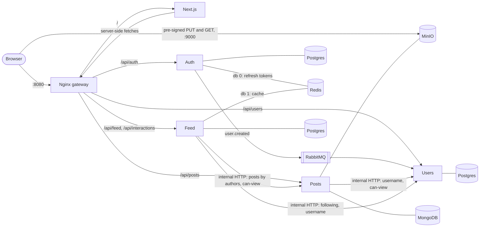

# Waymark

A social travel-log platform: people post trips (title, story, place, dates, 1–10 photos or videos), follow each other, and like and comment on posts. Four NestJS services behind an Nginx gateway, with a Next.js frontend.

## Run it

Needs Docker with Compose. Everything else runs in containers.

```bash
cp .env.example .env   # optional: every variable has a dev default
docker compose up --build
```

Open **http://localhost:8080**. The first build takes a few minutes.

| What | Where |
|---|---|
| App | http://localhost:8080 |
| API docs (Swagger) | http://localhost:8080/api/{auth,users,posts,feed}/docs |
| RabbitMQ management | http://localhost:15672 (`waymark` / `waymark`) |
| MinIO console | http://localhost:9001 (`waymark` / `waymark-secret`) |

**Google login** is optional. Without keys the button is hidden and email login works. To enable it, create an OAuth client in Google Cloud Console with the redirect URI `http://localhost:8080/api/auth/google/callback`, and set `GOOGLE_CLIENT_ID` and `GOOGLE_CLIENT_SECRET` in `.env`.

**Checks**

- `scripts/smoke.sh` (needs `curl` and `jq`) runs the main flows through the gateway against the running stack: two users, a private follow with request and accept, a real pre-signed upload, create and edit, 404 for a non-follower, the feed, likes and comments, archive and unarchive, token refresh and logout.
- `cd backend && npm ci && npm test` runs the unit tests: follow rules, the cursor format, the event retry policy, and the feed merge paging a fixed dataset with no gaps or duplicates.

## Architecture



| Service | Owns | Store |
|---|---|---|
| Auth | credentials, access and refresh JWTs, Google and email login (Passport) | Postgres, Redis (refresh tokens) |
| Users | profiles, usernames, follows and follow requests, privacy | Postgres |
| Posts | posts, media uploads, archiving | MongoDB, MinIO |
| Feed | feed composition, likes, comments | Postgres, Redis (cache) |

- **One origin.** Nginx routes `/api/<service>` to the owning service and everything else to Next.js. Service-to-service endpoints live under `/internal`, which the gateway never forwards.
- **Signup.** Auth saves the credentials, returns tokens and publishes `user.created` with the username and date of birth. Users creates the profile from that event. Meanwhile the web app polls `/api/users/me` with exponential backoff (5 attempts, skeleton first, then an error state).
- **Uploads.** The browser gets one pre-signed PUT URL per file from Posts and uploads straight to MinIO. Posts then checks each object's owner, type and size before saving the post.
- **Feed.** Fan-out on read: Feed gets the viewer's accepted follows from Users, then the newest posts of those authors plus the viewer's own from Posts, paged by a `(createdAt, _id)` cursor. Popular authors' latest 20 posts come from Redis.
- **Post page.** `/p/[id]` is server-rendered, with Open Graph tags, for public posts. Private and archived posts load in the browser with the viewer's token.

**Tech choices** (one line each, as asked):

- NestJS monorepo (`backend/apps/*`, `backend/libs/common`): shared guard, bootstrap and event types without publishing packages; each service keeps its own Dockerfile, container and database.
- TypeORM migrations run at startup (`synchronize` off); argon2 for passwords; class-validator on every DTO, rejecting unknown fields.
- Next.js App Router, Tailwind CSS, React Query (infinite scroll), Zustand (session), react-hook-form with zod, react-dropzone.
- Vitest for unit tests, Swagger per service.

## Decisions and deviations

The full log with reasons is [docs/decisions.md](docs/decisions.md); the IDs below refer to it.

**Following the clarifications**

- **The spec's diagram isn't taken literally** (clarification 7). It links Auth and Users directly, which clarification 7 says isn't needed, and it places RabbitMQ beside Post and Feed, though the spec's text uses the broker only for `user.created` and has Feed ask Users and Posts directly. We follow the text: Feed calls Users and Posts over internal HTTP, and RabbitMQ carries one event (A5).
- **MinIO instead of S3** (clarification 2). Uploads use real pre-signed URLs, and the code only talks to the S3 API. MinIO runs from the community `pgsty/minio` image, because MinIO withdrew its official images (**deviation**, A7).
- **Google login is optional** (clarification 2). The strategy is registered only when both keys are set (I6).
- **User Service owns the profile** (clarification 7). Auth stores only email, password hash and Google id. The username and date of birth travel in `user.created` (I1, I5).
- **Profile after signup** (clarification 7): polling with exponential backoff, 5 attempts, skeleton, then an error state (I5).
- **Likes and comments live in Feed's Postgres; Redis is only a cache** (clarification 5). Cached: popular authors' latest 20 posts (60 s) and like/comment counts (5 min, cleared on every change). Per-user first feed pages aren't cached: each would need clearing whenever any followed author posts, and the per-author cache already makes page 1 cheap (F3).
- **Private to public accepts all pending requests; rejected ones stay rejected** (clarification 8). Public to private keeps existing followers (G2).
- **No image processing** (clarification 6). Files are served as uploaded (L10).

**Our own choices**

- **Posts store object keys, not URLs** (**deviation**, P3). The bucket is private, and every API response signs 1-hour read URLs, so media follows the post's visibility.
- **Visibility** (G3). Authors always see their posts. Others see a post only if it isn't archived and the author is public or they are an accepted follower. Otherwise the API answers 404, which doesn't reveal that the post exists. A private profile's header and counts are public; its posts and lists aren't.
- **Tokens** (I3, I4). Classic access (15 min) plus refresh (7 days) JWTs with separate secrets, so a refresh token can't pass as an access token. Redis holds one entry per refresh token, and logout deletes it. The access token lives in memory. The refresh token is an `httpOnly`, `SameSite=Lax` cookie scoped to `/api/auth`. On a 401 the web app refreshes once and retries.
- **Usernames can't change once set** (I2), because posts and comments copy the author's username.
- **Incomplete profiles** (I7, I8). New Google users, and signups whose username was taken in the meantime, choose a username on `/onboarding`. Signup and onboarding check availability as you type and suggest free variants.
- **No automatic account linking** (I6). If a Google email already has a password account, the user is sent to log in with the password. Email signup doesn't verify addresses, so linking could hand over the Google user's account.
- **Events** (A5). Only `user.created` goes over RabbitMQ, through one durable queue. A malformed message goes straight to a dead-letter queue. Any other failure, such as Users' database being down, is retried with backoff and requeued until it succeeds, so an outage delays a new profile but never loses it. Profile creation is idempotent.
- **Internal calls** (A6). Plain HTTP on the Docker network with a 2 s timeout; failures become 503.
- **Degradation** (F4). Post pages render without likes and comments if Feed is down. Feed falls back to Postgres and Post Service if Redis is down.
- **Post location** (P1). The country is an ISO code chosen from a list, shown with its name and flag; coordinates come from a "Find on map" lookup of the city (OpenStreetMap Nominatim) instead of being typed.
- **Media placeholders** (P2, W4). The browser reads each file's average colour and size before upload, so pages reserve the right space and cards take the cover's colour. Uploads show progress.
- **Design** (W5). Photo-led, with serif titles, a dashed "trail" feed with a marker per post in the author's colour, two content widths, and a light/dark/system theme saved per browser.
- **Scope** (S1). Not built: search, notifications, admin, account and post deletion (archiving covers the latter), uploaded avatars (initials instead), tags, nested comments, feed ranking, map. A header box opens a profile by exact username, so people can find each other.

## Known limitations

- An access token stays valid until it expires (at most 15 min) after logout. Refresh tokens aren't rotated (L1, L2).
- A signed media URL works for its full hour, even after an unfollow or archive. `og:image` links expire too. Production would use a CDN with signed cookies (L3).
- Uploaded files are never deleted: unused uploads, files removed from a post, uploads over the size limit (L4).
- If RabbitMQ is down at signup, `user.created` is lost and the profile is never created. The outbox pattern would fix it (L5).
- Internal endpoints trust the Docker network, and all services share the access-token secret. Improvements: service-to-service auth, RS256 with only Auth holding the private key (L6, L12).
- The feed needs Users and Posts synchronously, and fetches the full following list on every request (L7, L8).
- No rate limiting on login, signup or the username check (L9).
- Popular authors' posts in other feeds can be up to 60 s stale, and a racing read can put an old like count back in the cache for up to 5 min (L11, L14).
- The Google OAuth handshake keeps its state in Auth's memory, which is fine for one Auth instance (L13).
- Media colour and size come from the client and are only cosmetic; "Find on map" needs internet and Nominatim (L15, L16).

## Scaling

**Stateless services.** Every service verifies access tokens on its own, and sessions and cache live in Redis, so Auth, Users, Posts and Feed can run as several instances behind the gateway. The exception is the Google OAuth state, which would move to a Redis session store. Several Users instances can consume `users_events` side by side, because profile creation is idempotent.

**Feed: fan-out on read vs on write.** The feed is built at read time, which keeps posting cheap and is right while follow lists are small. At scale the usual answer is a hybrid. On write, a new post's id is pushed into each follower's timeline list in Redis. Accounts with huge audiences stay on read-time merging, which is what the per-author top-20 cache already does. The following list (L8) would be cached as well.

**Caching and indexes.** Hot data is already cached: popular authors' latest posts and like/comment counts. Public post pages and media are good candidates for CDN caching. Every list is keyset-paged over an index: posts `{authorId, isArchived, createdAt, _id}`, follows `(followee_id, status)`, comments `(post_id, created_at, id)`. Pages stay fast however deep the scroll. Follower counts are indexed `COUNT`s today, and would become stored counters for very large accounts.

**Read replicas and partitioning.** Most traffic is reads: visibility checks, profiles, comment lists and profile grids. That traffic can go to Postgres read replicas and MongoDB secondaries. Posts would shard by `authorId`, which is how both profiles and the feed query them.

## Credits

Flag emoji use the Twemoji country-flag font from [country-flag-emoji-polyfill](https://github.com/talkjs/country-flag-emoji-polyfill) (MIT); the flag artwork is [Twemoji](https://github.com/twitter/twemoji), licensed under [CC BY 4.0](https://creativecommons.org/licenses/by/4.0/).

## Repository layout

```text
backend/            NestJS monorepo: apps/{auth,users,posts,feed}, libs/common
web/                Next.js app
gateway/nginx.conf  routing
scripts/smoke.sh    end-to-end checks through the gateway
docs/               assignment (spec and clarifications), decisions, build plan
```
